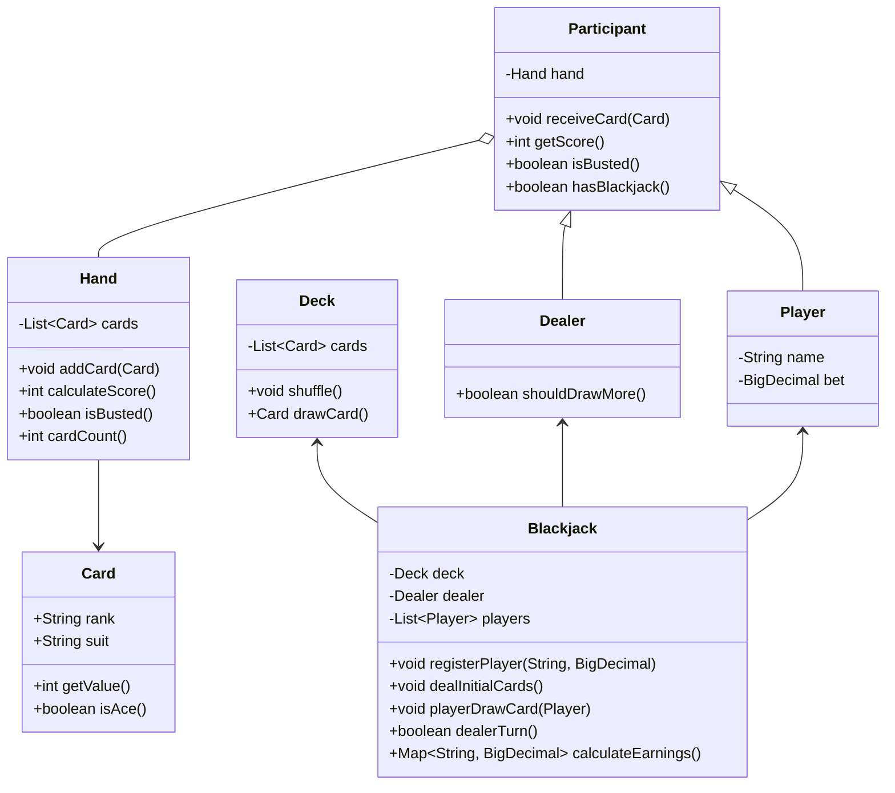

# Blackjack
- [요구사항](#요구사항)
- [도메인 모델](#도메인-모델)
- [객체지향 설계](#객체지향-설계)
- [프로그래밍 요구사항](#프로그래밍-요구사항)

 
  

## 요구사항
- [x] 플레이어는 베팅 금액을 정한다.
- [x] 플레이어/딜러는 2장의 카드를 지급받는다.
- [x] 두 장의 카드 숫자를 합쳐 21과 비교한다 (플레이어의 경우):
   - [x] 21 이하: 원한다면 카드를 추가로 뽑을 수 있다.
   - [x] 21 초과: 베팅 금액을 모두 잃는다.
   - [x] 21: 블랙잭!
        - [x] 베팅 금액의 1.5배 배당을 받는다.
        - [x] 딜러와 동시에 블랙잭인 경우 베팅금을 반환받는다.
- [x] 딜러는 처음 두 장 합계가 16 이하일 때 반드시 한 장을 더 뽑고, 17 이상이면 뽑지 않는다.
- [x] 딜러가 21 초과로 버스트하면 남아 있는 모든 플레이어가 베팅 금액을 반환받는다.

 
 

## 도메인 모델

 
 

## 객체지향 설계

### 책임 및 역할 분리

| 객체                       | 책임 및 역할                                  |
| -------------------------- | ---------------------------------------- |
| `Hand`                     | 카드 목록 관리, 점수 계산(Ace 최적 처리), 버스트 판정       |
| `Card`                     | 점수값 제공, Ace 여부 판단              |
| `Deck`                     | 52장 초기화, 셔플, 카드 한 장 추출                     |
| `Participant`              | 공통 필드(`Hand`), 카드 지급 받기, 점수 조회, 버스트 여부       |
| `Player`, `Dealer`         | `Participant` 상속, 플레이어: 이름, 베팅 / 딜러: 히트 규칙 |
| `Blackjack` (서비스)          | 비즈니스 로직(플레이어 등록→카드 분배→플레이어/딜러 턴→수익 계산)          |
| `BlackjackController`      | UI 로직 제어, 서비스 호출 순서 관리                   |
| `InputView` / `OutputView` | 콘솔 입출력, 결과 출력                   |
| `Validator`                | 입력 파싱 및 도메인 검증                   |

 
 

## 프로그래밍 요구사항

* **TDD 준수**: UI 제외 모든 public 메서드 단위 테스트 완료

* **인덴트 ≤ 2, 메서드 ≤ 15줄**
* **엔티티 크기 ≤ 50줄, 파일 수 ≤ 10**
* **필드 ≤ 3개 클래스**
* **중복 코드 제거**: `Participant`를 추상클래스로 하여 딜러와 플레이어의 공통 로직 통합

